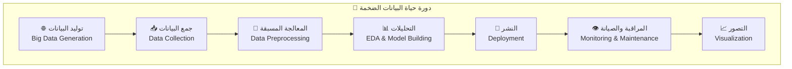
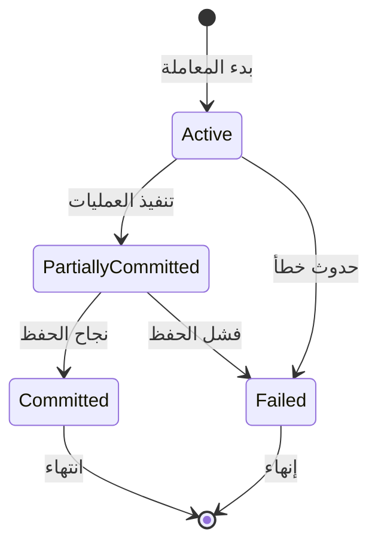
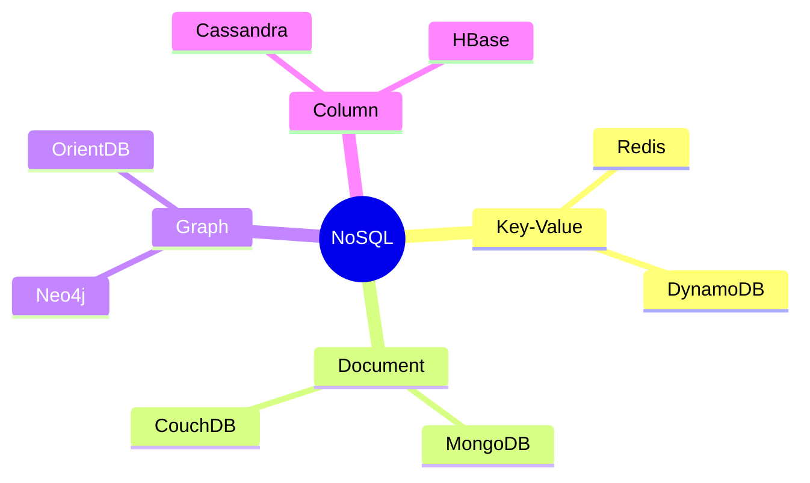
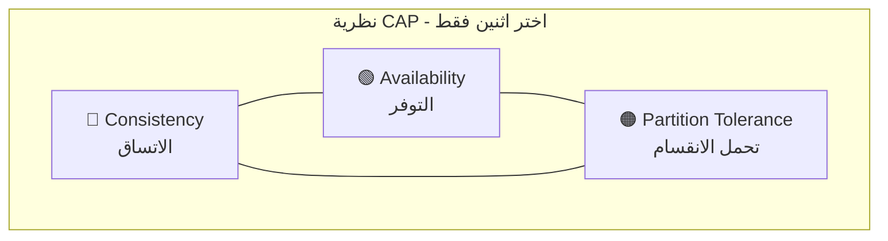
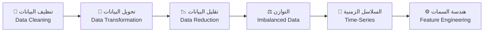
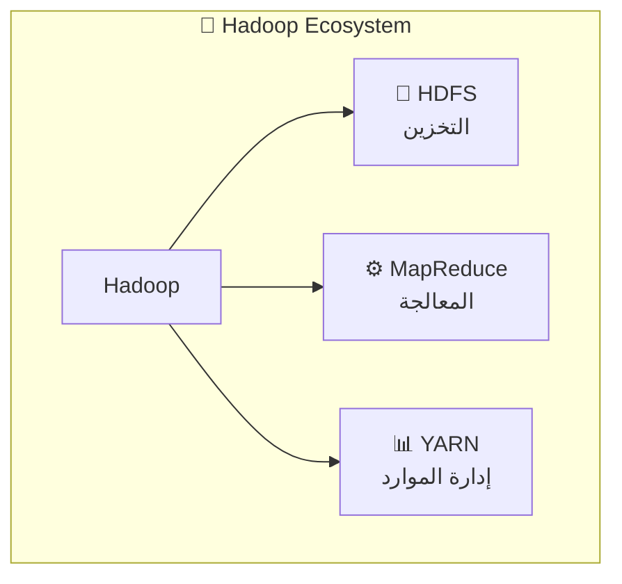
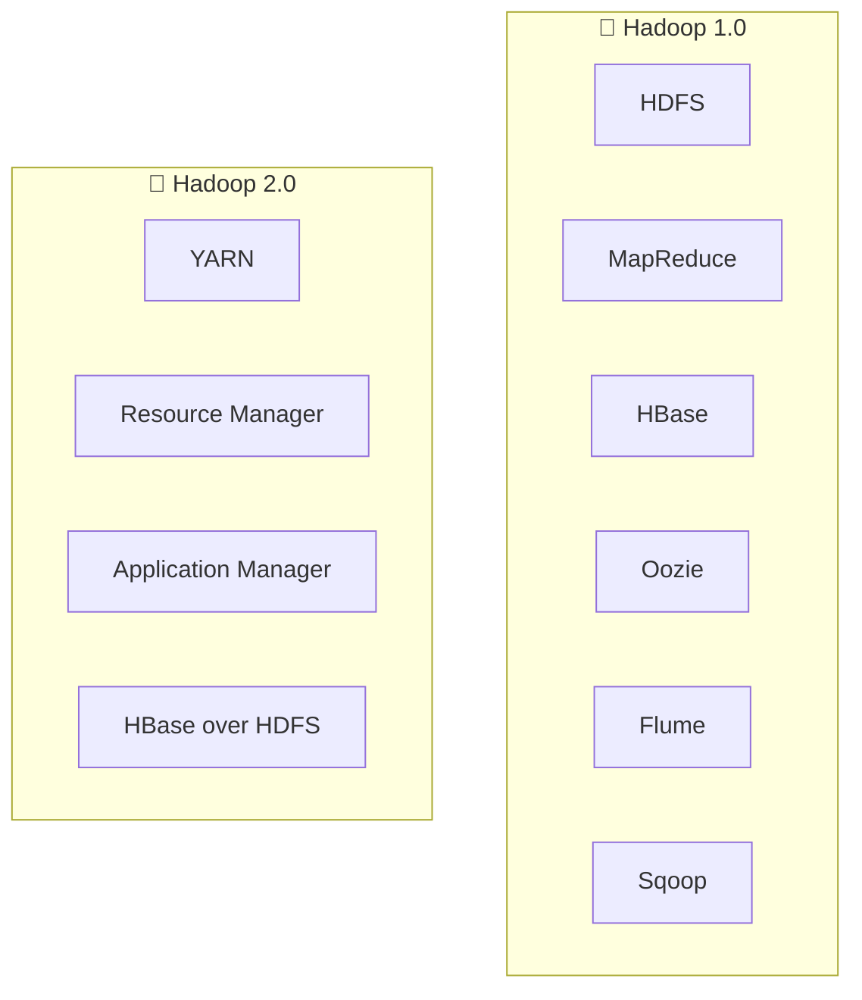
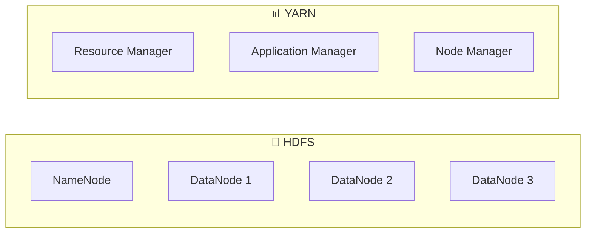
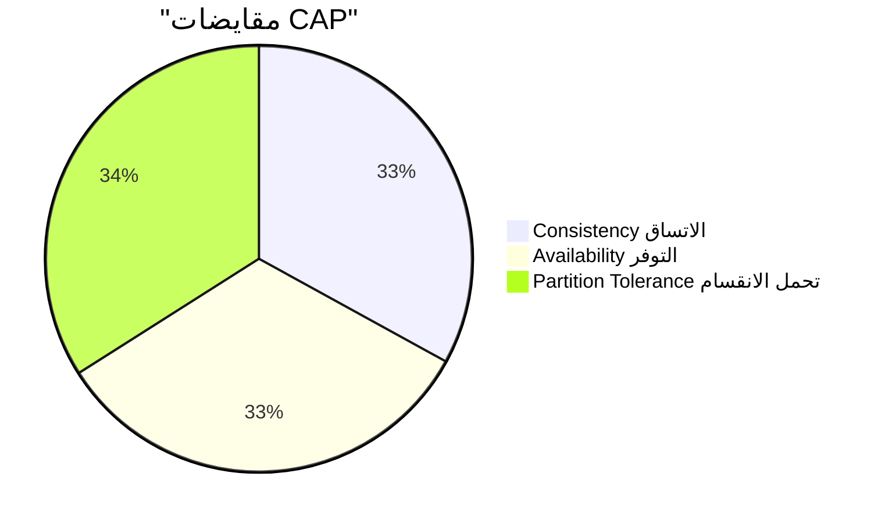

# 📚 ملخص أسئلة مقرر البيانات الضخمة (22 سؤال)

> [!NOTE]
> **ملاحظة**: الإجابات مبنية على ملفات المقرر. البنود المستخرجة من صور PDF عبر OCR سيُشار لها بذلك.

**📁 المصادر الأساسية**:
| الملف | الوصف |
|-------|-------|
| `Lec 1 Lect 2 Lec 3.pdf` | المحاضرات 1-3 |
| `Lect 4 Big Data2 _011245.pdf` | المحاضرة 4 |
| `Big Data with Hadoop.pdf` | هادوب والبيانات الضخمة |

---

## 🔷 سؤال 1: ماهي البيانات الكبيرة (الضخمة)؟ مع ذكر خصائص البيانات الضخمة؟

<table>
<tr><td>📝 <b>الشرح</b></td></tr>
<tr><td>البيانات الضخمة (Big Data) هي مجموعات بيانات كبيرة ومعقدة جدًا لا تكفي الأدوات التقليدية للتعامل معها بكفاءة، وهدفها المعالجة والتخزين والتحليل لاستخراج رؤى ودعم القرار.</td></tr>
</table>

**✨ الخصائص الأساسية (3Vs)**:
| الخاصية | بالعربية | الوصف |
|---------|----------|-------|
| 🔹 Volume | الحجم | كميات هائلة من البيانات |
| 🔹 Velocity | السرعة | سرعة توليد ومعالجة البيانات |
| 🔹 Variety | التنوع | أنواع مختلفة من البيانات |

> **💡 مثال واقعي**: منصات التواصل مثل Facebook وTwitter وInstagram وLinkedIn كمصادر بيانات ضخمة.

📖 **المصدر**: `Lect 4 Big Data2 _011245.pdf` صفحة 3 وصفحة 10

---

## 🔶 سؤال 2: لماذا نحتاج البيانات الضخمة؟ مع ذكر تطبيقات البيانات الضخمة؟

<table>
<tr><td>📝 <b>الشرح</b></td></tr>
<tr><td>تساعد البيانات الضخمة على زيادة دقة التحليل، ودعم القرارات السريعة، وتحقيق ميزة تنافسية.</td></tr>
</table>

**📌 تطبيقات البيانات الضخمة**:

| المجال | التطبيق |
|--------|---------|
| 🏥 الرعاية الصحية | Healthcare Analytics |
| 💰 الخدمات المالية | Financial Services |
| 🛒 التجارة الإلكترونية | E-Commerce & Retail |
| 📡 الاتصالات | Telecommunications |
| 🏭 أخرى | الصناعة، المدن الذكية، الطاقة، التعليم، الإعلام، النقل |

> **💡 مثال واقعي**: شركات الخدمات المالية تستخدم تحليلات البيانات لكشف الاحتيال في المعاملات.

📖 **المصدر**: `Lec 1 Lect 2 Lec 3.pdf` صفحات 35-40

---

## 🔷 سؤال 3: ماهي قواعد البيانات مع ذكر المكونات الخاصة بقواعد البيانات؟

<table>
<tr><td>📝 <b>الشرح</b></td></tr>
<tr><td>قاعدة البيانات (Database) هي المكون المركزي الذي تُنظم فيه البيانات (جداول/صفوف/أعمدة/علاقات)، ويقوم DBMS بإدارة التخزين والاسترجاع والأمن والتزامن.</td></tr>
</table>

**🧩 مكونات بيئة DBMS**:

```
┌─────────────────────────────────────────────────────────┐
│                    🗄️ DBMS Environment                  │
├─────────────────────────────────────────────────────────┤
│  📊 Database         │  قاعدة البيانات                  │
│  ⚙️ DBMS             │  نظام إدارة قواعد البيانات       │
│  🖥️ Hardware         │  العتاد                          │
│  💿 Software         │  البرمجيات                       │
│  👥 Users            │  DBA, Designer, Programmers      │
└─────────────────────────────────────────────────────────┘
```

> **💡 مثال واقعي**: MySQL، PostgreSQL، Oracle، SQL Server، MongoDB.

📖 **المصدر**: `Lec 1 Lect 2 Lec 3.pdf` صفحات 46-49

---

## 🔶 سؤال 4: دورة حياة قواعد البيانات، ودورة حياة البيانات الضخمة؟

### 📊 دورة حياة قواعد البيانات (RDBMS Life Cycle)

```mermaid
%%{init: {"flowchart": {"curve": "basis"}}}%%
flowchart LR
    RA["1️⃣ تحليل المتطلبات<br/>Requirement Analysis"]
    DD["2️⃣ تصميم قاعدة البيانات<br/>Database Design"]
    ES["3️⃣ التقييم والاختيار<br/>Evaluation and Selection"]
    LD["4️⃣ التصميم المنطقي<br/>Logical Database Design"]
    PD["5️⃣ التصميم الفيزيائي<br/>Physical Database Design"]
    IM["6️⃣ التنفيذ<br/>Implementation"]
    DL["7️⃣ تحميل البيانات<br/>Data Loading"]
    TT["8️⃣ الاختبار وضبط الأداء<br/>Testing and Performance Tuning"]
    OM["9️⃣ التشغيل والصيانة<br/>Operate and Maintain"]
    GC["🔟 النمو والتغيير<br/>Growth and Change"]

    RA --> DD --> ES --> LD --> PD --> IM --> DL --> TT --> OM --> GC --> RA

    classDef rect fill:#ffffff,stroke:#7b61ff,stroke-width:1px,rx:0,ry:0;
    class RA,DD,ES,LD,PD,IM,DL,TT,OM,GC rect;
```



### 📊 دورة حياة البيانات الضخمة (Big Data Life Cycle)



| دورة RDBMS | دورة Big Data |
|------------|---------------|
| Requirement Analysis | Big Data Generation |
| Database Evaluation | Data Collection |
| Logical Design | Data Preprocessing |
| Physical Design | EDA & Model Building |
| Implementation | Deployment |
| Testing & Tuning | Monitoring & Maintenance |
| Operate & Maintain | Visualization |
| Growth & Change | - |

> **💡 مثال واقعي**: استخدام Hadoop + HDFS + MapReduce ضمن دورة المعالجة.

📖 **المصدر**: `Lec 1 Lect 2 Lec 3.pdf` صفحة 45 (OCR)، و`Lect 4 Big Data2 _011245.pdf` صفحات 6-9 و18-25

---

## 🔷 سؤال 5: عرف نموذج البيانات وعدد أنواع نماذج البيانات المستخدمة؟

<table>
<tr><td>📝 <b>الشرح</b></td></tr>
<tr><td>نموذج البيانات (Data Model) تمثيل مفاهيمي يحدد كيفية هيكلة البيانات وتنظيمها وعلاقاتها داخل نظام قاعدة البيانات.</td></tr>
</table>

**📌 أنواع نماذج البيانات**:

| النوع | بالإنجليزية | الوصف |
|-------|-------------|-------|
| 🔹 العلائقي | Relational | جداول مترابطة |
| 🔹 الكيان–العلاقة | Entity-Relationship | رسم العلاقات |
| 🔹 الكائني | Object-Oriented | كائنات وفئات |
| 🔹 الرسم البياني | Graph | عقد وحواف |
| 🔹 السلاسل الزمنية | Time-Series | بيانات زمنية |

> **💡 مثال واقعي**: قواعد مثل Oracle/MySQL تعتمد النموذج العلائقي.

📖 **المصدر**: `Lec 1 Lect 2 Lec 3.pdf` صفحات 50-55

---

## 🔶 سؤال 6: مفاهيم المعاملات والنظام، حالات المعاملة، الخصائص المرغوبة للمعاملات؟

<table>
<tr><td>📝 <b>الشرح</b></td></tr>
<tr><td>المعاملة (Transaction) وحدة منطقية تتضمن عمليات قراءة/كتابة على قاعدة البيانات.</td></tr>
</table>

### 🔄 حالات المعاملة:



| الحالة | بالإنجليزية |
|--------|-------------|
| ⚡ نشطة | Active |
| 🔄 التزام جزئي | Partially Committed |
| ✅ التزام | Committed |
| ❌ فشل | Failed |
| 🏁 إنهاء | Terminated |

### 🛡️ خصائص ACID:

| الخاصية | بالإنجليزية | الوصف |
|---------|-------------|-------|
| 🔹 الذرية | Atomicity | إما كلها أو لا شيء |
| 🔹 الاتساق | Consistency | الحفاظ على صحة البيانات |
| 🔹 العزل | Isolation | عدم تداخل المعاملات |
| 🔹 المتانة | Durability | ثبات التغييرات |

> **💡 مثال واقعي**: تحويل بنكي كامل يُعد معاملة واحدة.

📖 **المصدر**: `Lec 1 Lect 2 Lec 3.pdf` صفحات 63-73

---

## 🔷 سؤال 7: عيوب قاعدة البيانات العلائقية؟

<table>
<tr><td>📝 <b>الشرح</b></td></tr>
<tr><td>حسب المقرر، هذه أهم عيوب قواعد البيانات العلائقية.</td></tr>
</table>

**⚠️ العيوب الرئيسية (حسب المقرر)**:

| العيب | المصطلح بالإنجليزية | الشرح المختصر |
|------|-------------------|--------------|
| عدم قابلية التوسع | Lack of Scalability | يصعب التعامل مع هيكل القاعدة عند توزيعها على خوادم متعددة ومع كميات بيانات كبيرة، ويؤثر ذلك على الأداء والتوفر وزمن التحميل |
| مشكلة الصيانة | Maintenance Problem | تصبح الصيانة أصعب مع زيادة البيانات وتحتاج وقتًا أكبر من المطورين |
| التكلفة | Cost | تكلفة الإعداد والصيانة مرتفعة، خصوصًا للشركات الصغيرة |
| التعقيد في الهيكل | Complexity in Structure | تمثيل العلاقات المعقدة صعب لأن البيانات تُخزن في جداول متعددة تؤثر على منطق التطبيق |
| انخفاض الأداء مع مرور الوقت | Decrease in Performance Over Time | كثرة الجداول والبيانات تزيد التعقيد وتُبطئ الاستعلامات وقد تسبب فشلًا |
| التعقيد في البيئات الموزعة | Complexity in Distributed Environments | ليست مناسبة دائمًا للبيئات الموزعة/السحابية وصعب إدارة الاتساق والتوفر وتحمل الأقسام |
| صعوبة التعامل مع البيانات الضخمة | Difficulty in Handling Big Data | اختناقات أداء وقد يلزم إعادة تصميم لتحسين التوسع والسرعة |

**تفاصيل مرتبطة بالبيانات الضخمة (حسب المقرر)**:
- تضخم حجم البيانات إلى تيرابايت/بيتابايت يمثل تحديًا لـRDBMS.
- زيادة المعالجات والذاكرة لعمل التوسع الرأسي يرفع التكلفة.
- قرابة 80% من البيانات شبه منظمة أو غير منظمة، وRDBMS لا يتعامل معها بكفاءة.

> **💡 مثال واقعي**: الاتجاه إلى NoSQL مثل Cassandra أو MongoDB لمعالجة الحجم الكبير والبيئات الموزعة.

📖 **المصدر**: `Lec 1 Lect 2 Lec 3.pdf` صفحات 76-81

---

## 🔶 سؤال 8: الفرق بين قواعد البيانات العلائقية والبيانات الكبيرة

**📊 جدول المقارنة مع المصطلحات**:

| المعيار (Criterion) | 🔵 RDBMS | 🟠 Big Data |
|---------------------|---------|------------|
| **الحجم (Volume)** | GB/TB | PB/ZB |
| **التنظيم (Organization)** | مركزي (Centralized) | موزع (Distributed) |
| **نوع البيانات (Data Type)** | منظمة فقط (Structured) | منظمة/شبه/غير منظمة (Structured/Semi/Unstructured) |
| **نوع العتاد (Hardware Type)** | خوادم عالية (High-end) | أجهزة سلع (Commodity) |
| **التحديثات (Updates)** | قراءة/كتابة متكررة | كتابة مرة وقراءة مرات (Write Once, Read Many Times) |
| **المخطط (Schema)** | ثابت (Static) | مرن/ديناميكي (Dynamic) |

> **💡 مثال واقعي**: التخزين الموزع في HDFS ضمن Hadoop.

📖 **المصدر**: `Lec 1 Lect 2 Lec 3.pdf` صفحة 81

---

## 🔷 سؤال 9: ماهي قواعد بيانات NoSQL؟ أنواعها؟ مميزاتها؟

<table>
<tr><td>📝 <b>الشرح</b></td></tr>
<tr><td>NoSQL قواعد بيانات غير علائقية (Non-Relational)، مصممة للتوسع الأفقي والتعامل مع البيانات الضخمة وشبه/غير المنظمة.</td></tr>
</table>

### 📦 أنواع NoSQL:



| النوع | الوصف | مثال |
|-------|-------|------|
| 🔹 Key-Value | مفتاح-قيمة | Redis, DynamoDB |
| 🔹 Document | مستندات | MongoDB |
| 🔹 Graph | رسم بياني | Neo4j |
| 🔹 Column | أعمدة | Cassandra, HBase |

### ✨ المميزات:

| الميزة | الوصف |
|--------|-------|
| ✅ Schema-less | بدون مخطط ثابت |
| ✅ Horizontal Scaling | توسع أفقي |
| ✅ Distributed Computing | حوسبة موزعة |
| ✅ Lower Cost | تكلفة أقل |
| ✅ Big Data Ready | مناسبة للبيانات الضخمة |

📖 **المصدر**: `Lec 1 Lect 2 Lec 3.pdf` صفحات 82-105 و107

---

## 🔶 سؤال 10: نظرية CAP وخصائص BASE؟

### ⚖️ نظرية CAP:



> [!IMPORTANT]
> لا يمكن لأي نظام موزع تحقيق الاتساق والتوفر وتحمل الانقسام معًا؛ عادة يتم تحقيق اثنين فقط.

### 🔄 خصائص BASE:

| الخاصية | بالإنجليزية | الوصف |
|---------|-------------|-------|
| 🔹 BA | Basically Available | متاحة بشكل أساسي |
| 🔹 S | Soft State | حالة ناعمة |
| 🔹 E | Eventually Consistent | اتساق نهائي |

### 📊 أمثلة على الأنظمة:

| التصنيف | الأنظمة |
|---------|---------|
| **AP** | Amazon DynamoDB, Apache Cassandra |
| **CP** | Google Cloud Spanner, PostgreSQL |

📖 **المصدر**: `Lec 1 Lect 2 Lec 3.pdf` صفحات 84-94 و88

---

## 🔷 سؤال 11: مصادر البيانات الضخمة ودورة حياتها؟

### 🌐 المصادر الشائعة:

| المصدر | الوصف |
|--------|-------|
| 📱 Social Media | وسائل التواصل الاجتماعي |
| 💳 Transaction Data | بيانات المعاملات |
| 📡 Sensor Data/IoT | بيانات الاستشعار/إنترنت الأشياء |
| 🌐 Web & Clickstream | بيانات الويب والنقرات |

### 🔄 الدورة المختصرة:

```
توليد البيانات ➡️ جمعها ➡️ معالجتها ➡️ التحليلات ➡️ التصور
```

> **💡 مثال واقعي**: Facebook وTwitter وInstagram وLinkedIn كمصادر بيانات اجتماعية.

📖 **المصدر**: `Lect 4 Big Data2 _011245.pdf` صفحات 10-11 و18

---

## 🔶 سؤال 12: عرف المعالجة المسبقة للبيانات وخطواتها بالتفصيل؟

<table>
<tr><td>📝 <b>الشرح</b></td></tr>
<tr><td>المعالجة المسبقة (Data Preprocessing) تحويل البيانات الأولية إلى بيانات متسقة ودقيقة مناسبة للتحليل.</td></tr>
</table>

### 🔧 خطوات المعالجة المسبقة:



### 🧹 تنظيف البيانات يشمل:

| المشكلة | الحل |
|---------|------|
| ❌ Missing Values | معالجة القيم المفقودة |
| ❌ Duplicates | إزالة التكرارات |
| ❌ Inaccuracies | تصحيح الأخطاء |
| ❌ Standardization | توحيد الصيغ |
| ❌ Outliers | معالجة القيم المتطرفة |
| ❌ Inconsistencies | حل التناقضات |

> **💡 مثال واقعي**: تنظيف بيانات منشورات Facebook/Twitter قبل التحليل.

📖 **المصدر**: `Lect 4 Big Data2 _011245.pdf` صفحات 18 و30-36 و32-33

---

## 🔷 سؤال 13: أنواع البيانات؟ وكم نسبة توليد كل نوع خلال السنوات الأخيرة؟

### 📊 أنواع البيانات:

| النوع | بالإنجليزية | مثال |
|-------|-------------|------|
| 🔹 منظمة | Structured | جداول SQL |
| 🔹 غير منظمة | Unstructured | صور، فيديو، نصوص |
| 🔹 شبه منظمة | Semi-structured | JSON, XML |

### 📈 نسبة التوليد:

```
┌─────────────────────────────────────────────────────────┐
│  📊 نسبة أنواع البيانات المُولَّدة                      │
├─────────────────────────────────────────────────────────┤
│  ████████████████████████████████████████░░░░░░░ 80%   │
│  غير منظمة (Unstructured)                              │
├─────────────────────────────────────────────────────────┤
│  ████████░░░░░░░░░░░░░░░░░░░░░░░░░░░░░░░░░░░░░░ 20%    │
│  منظمة + شبه منظمة                                     │
└─────────────────────────────────────────────────────────┘
```

> [!TIP]
> حوالي **80%** من البيانات التي يتم إنشاؤها هي غير منظمة!

> **💡 مثال واقعي**: الصور والمنشورات في Facebook تُعد بيانات غير منظمة.

📖 **المصدر**: `Lect 4 Big Data2 _011245.pdf` صفحات 14-16

---

## 🔶 سؤال 14: ما هي Hadoop؟ مكوناتها؟ الفرق بين Hadoop 1 و Hadoop 2؟

<table>
<tr><td>📝 <b>الشرح</b></td></tr>
<tr><td>Hadoop إطار عمل مفتوح المصدر للتخزين الموزع ومعالجة البيانات الضخمة.</td></tr>
</table>

### 🏗️ المكونات الأساسية:



### ⚖️ الفرق بين الإصدارين:

| المعيار | 🔵 Hadoop 1.x | 🟢 Hadoop 2.x |
|---------|---------------|---------------|
| **المعالجة** | Batch فقط (MapReduce) | متعددة (YARN) |
| **Real-time** | ❌ لا يدعم | ✅ يدعم |
| **نقطة الفشل** | NameNode واحد | HA NameNode |
| **إدارة الموارد** | JobTracker | Resource Manager + Node Manager |
| **التوسع** | محدود | أفقي واسع |

> **💡 مثال واقعي**: تشغيل مهام MapReduce على بيانات مخزنة في HDFS ضمن Hadoop.

📖 **المصدر**: `Big Data with Hadoop.pdf` صفحة 31، وصفحات 36-38 (OCR)، و`Lect 4 Big Data2 _011245.pdf` صفحة 6

---

## 🔷 سؤال 15: ما هو Hadoop Ecosystem؟ اذكر مكونات Hadoop؟

### 🌐 Hadoop Ecosystem:



| المكون | الوظيفة |
|--------|---------|
| 📁 HDFS | نظام الملفات الموزع |
| ⚙️ MapReduce | معالجة البيانات |
| 🗄️ HBase | قاعدة بيانات NoSQL |
| 📅 Oozie | جدولة سير العمل |
| 📥 Flume | جمع البيانات |
| 🔄 Sqoop | نقل البيانات من/إلى RDBMS |
| 📊 YARN | إدارة الموارد (Hadoop 2.0) |

> **💡 مثال واقعي**: Oozie لجدولة سير العمل، وHive كمستودع بيانات.

📖 **المصدر**: `Big Data with Hadoop.pdf` صفحات 30 و34 (OCR) + صفحات 32-34

---

## 🔶 سؤال 16: اشرح أداة Mahout وعدد جميع مكوناتها؟

<table>
<tr><td>📝 <b>الشرح</b></td></tr>
<tr><td>Apache Mahout إطار جبر خطي موزع مع Scala DSL يساعد علماء البيانات والإحصائيين على تنفيذ خوارزمياتهم بسرعة.</td></tr>
</table>

### 🧩 مكونات Mahout:

| المكون | الوظيفة |
|--------|---------|
| 🔹 Recommendation | التوصيات (Collaborative Filtering) |
| 🔹 Classification | التصنيف |
| 🔹 Clustering | التجميع |
| 🔹 Dimensionality Reduction | تخفيض الأبعاد |
| 🔹 Mahout Math | مكتبة الجبر الخطي |

> [!NOTE]
> هذه المعلومات عامة وليست جميعها واردة نصيًا في المقرر.

> **💡 مثال واقعي**: Mahout كأداة تعلم آلي موزعة ضمن Hadoop.

📖 **المصدر**: `Big Data with Hadoop.pdf` صفحة 33

---

## 🔷 سؤال 17: عدد التحديات التي تواجه البيانات الضخمة؟

### ⚠️ تحديات جودة البيانات:

| التحدي | بالإنجليزية |
|--------|-------------|
| ❌ أخطاء في البيانات | Inaccuracies |
| ❌ عدم اكتمال البيانات | Missing Values |
| ❌ عدم اتساق البيانات | Inconsistencies |
| ❌ التكرارات | Duplicates |
| ❌ القيم المتطرفة | Outliers |
| ❌ اختلاف التنسيقات | Heterogeneous Sources |

> [!WARNING]
> لم يرد نص صريح عن تحديات الحجم/السرعة/التنوع، لكن المقرر يشير لتحديات جمع ومعالجة البيانات من مصادر متعددة.

> **💡 مثال واقعي**: بيانات وسائل التواصل تحتاج تنظيفًا بسبب التكرار وعدم الاتساق.

📖 **المصدر**: `Lect 4 Big Data2 _011245.pdf` صفحات 30-36

---

## 🔶 سؤال 18: ما هي أفضل سحابة يمكن استخدامها في معالجة البيانات الضخمة؟

<table>
<tr><td>📝 <b>الشرح</b></td></tr>
<tr><td>المقرر لا يحدد "الأفضل"، لكنه يذكر منصات سحابية (Cloud Platforms) لمعالجة البيانات الضخمة.</td></tr>
</table>

### ☁️ المنصات السحابية المذكورة:

| المنصة | الشركة |
|--------|--------|
| 🟠 AWS | Amazon Web Services |
| 🔵 Azure | Microsoft |
| 🟢 GCP | Google Cloud Platform |

> **💡 مثال واقعي**: استخدام AWS أو Azure أو GCP لمعالجة البيانات الضخمة حسب الحاجة.

📖 **المصدر**: `Lec 1 Lect 2 Lec 3.pdf` صفحة 16

---

## 🔷 سؤال 19: ما المقصود بـMachine Learning التعلّم الآلي؟ وما الأنواع الرئيسية؟

<table>
<tr><td>📝 <b>الشرح</b></td></tr>
<tr><td>ذُكر التعلم الآلي ضمن تحليلات البيانات الضخمة لكنه لم يُعرَّف تفصيليًا في المقرر.</td></tr>
</table>

### 🤖 أنواع التعلم الآلي:

| النوع | بالإنجليزية | الوصف | مثال |
|-------|-------------|-------|------|
| 🔹 مراقَب | Supervised | يتعلم من بيانات لها مُخرجات معروفة | تصنيف البريد المزعج |
| 🔹 غير مراقَب | Unsupervised | يكتشف الأنماط دون مُخرجات | تجميع العملاء |
| 🔹 بالتعزيز | Reinforcement | يتعلم عبر المكافآت والعقوبات | تدريب وكيل للعب |

> [!NOTE]
> هذه معلومات عامة وليست جميعها من المقرر مباشرة.

> **💡 مثال واقعي من المقرر**: تحليل النصوص غير المنظمة أصبح ممكنًا بفضل التعلم الآلي.

📖 **المصدر**: `Lect 4 Big Data2 _011245.pdf` صفحة 7

---

## 🔶 سؤال 20: الفرق بين HDFS و YARN؟

### ⚖️ المقارنة:

| المعيار | 📁 HDFS | 📊 YARN |
|---------|---------|---------|
| **النوع** | نظام ملفات موزع | مدير موارد |
| **الوظيفة** | تخزين واسترجاع البيانات | جدولة/مراقبة الوظائف |
| **المكونات** | NameNode, DataNode | Resource Manager, Application Manager |
| **الهدف** | توفير تخزين موثوق | توزيع عادل للموارد |



> **💡 مثال واقعي**: تشغيل مهام MapReduce على بيانات في HDFS عبر YARN.

📖 **المصدر**: `Big Data with Hadoop.pdf` صفحات 18 و34

---

## 🔷 سؤال 21: تطبيقات أداة Mahout؟

<table>
<tr><td>📝 <b>الشرح</b></td></tr>
<tr><td>محرك توصيات باستخدام Mahout (من OCR).</td></tr>
</table>

### 📌 التطبيقات:

| التطبيق | الوصف |
|---------|-------|
| 🔹 أنظمة التوصيات | Recommendation Systems |
| 🔹 تصنيف المستندات | Document Classification |
| 🔹 تجميع البيانات | Data Clustering |

> **💡 مثال واقعي**: توصيات LinkedIn (LinkedIn Recommendations) باستخدام Mahout.

📖 **المصدر**: `Big Data with Hadoop.pdf` صفحة 35 (OCR)

---

## 🔶 سؤال 22: الأنظمة الموزعة وخصائصها والتحديات؟

### ✨ الخصائص:

| الخاصية | الوصف |
|---------|-------|
| 🔹 توزيع البيانات | عبر أكثر من جهاز لزيادة الموثوقية |
| 🔹 المعالجة المتوازية | Parallel Processing |
| 🔹 التوسع الأفقي | Horizontal Scaling |

### ⚠️ التحديات (CAP):



> [!IMPORTANT]
> صعوبة الجمع بين الاتساق والتوفر وتحمل الانقسام في نظام موزع واحد.

### 📊 أمثلة:

| التصنيف | الأنظمة |
|---------|---------|
| **AP** | DynamoDB, Cassandra |
| **CP** | Google Cloud Spanner, PostgreSQL |

📖 **المصدر**: `Lec 1 Lect 2 Lec 3.pdf` صفحات 84-87 و88 و102

---

## 📋 ملخص سريع

| # | السؤال | الموضوع الرئيسي |
|---|--------|-----------------|
| 1 | تعريف البيانات الضخمة | 3Vs: Volume, Velocity, Variety |
| 2 | أهمية وتطبيقات | Healthcare, Finance, E-Commerce |
| 3 | قواعد البيانات | DBMS Components |
| 4 | دورة الحياة | RDBMS vs Big Data Lifecycle |
| 5 | نماذج البيانات | Relational, ER, Graph |
| 6 | المعاملات | ACID Properties |
| 7 | عيوب RDBMS | Scalability, Unstructured Data |
| 8 | RDBMS vs Big Data | المقارنة الشاملة |
| 9 | NoSQL | Types & Advantages |
| 10 | CAP & BASE | Distributed Systems Theory |
| 11 | مصادر البيانات | Social Media, IoT, Transactions |
| 12 | المعالجة المسبقة | Data Cleaning Steps |
| 13 | أنواع البيانات | 80% Unstructured |
| 14 | Hadoop | Hadoop 1 vs 2 |
| 15 | Hadoop Ecosystem | HDFS, MapReduce, YARN |
| 16 | Mahout | ML Library |
| 17 | التحديات | Data Quality Issues |
| 18 | السحابة | AWS, Azure, GCP |
| 19 | Machine Learning | Supervised, Unsupervised |
| 20 | HDFS vs YARN | Storage vs Resource Management |
| 21 | تطبيقات Mahout | Recommendations |
| 22 | الأنظمة الموزعة | CAP Theorem |

---

> **🎯 بالتوفيق في الاختبار!** 📚
