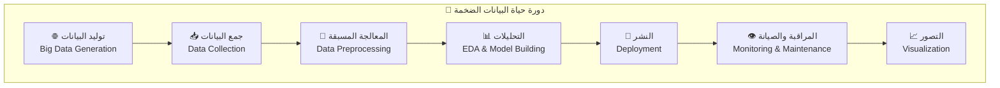
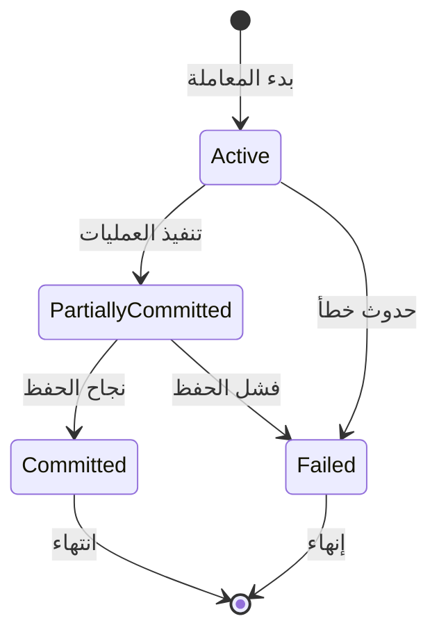
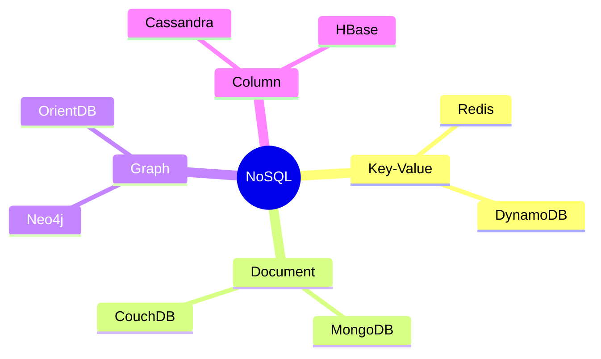
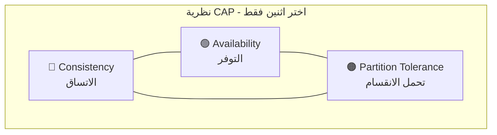

# 📚 ملخص أسئلة مقرر البيانات الضخمة (22 سؤال)
**✍️ إعداد: م. موسى العواضي**

> [!NOTE]
> **ملاحظة**: الإجابات مبنية على ملفات المقرر.

**📁 المصادر الأساسية**:
| الملف | الوصف |
|-------|-------|
| `Lec 1 Lect 2 Lec 3.pdf` | المحاضرات 1-3 |
| `Lect 4 Big Data2 _011245.pdf` | المحاضرة 4 |
| `Big Data with Hadoop.pdf` | هادوب والبيانات الضخمة |

---

## 🔷 سؤال 1: ماهي البيانات الكبيرة (الضخمة)؟ مع ذكر خصائص البيانات الضخمة؟

<table>
<tr><td>📝 <b>الشرح</b></td></tr>
<tr><td>البيانات الضخمة (Big Data) هي مجموعات بيانات كبيرة ومعقدة جدًا لا تكفي الأدوات التقليدية للتعامل معها بكفاءة، وهدفها المعالجة والتخزين والتحليل لاستخراج رؤى ودعم القرار.</td></tr>
</table>

**✨ الخصائص الأساسية (3Vs)**:
| الخاصية | بالعربية | الوصف |
|---------|----------|-------|
| 🔹 Volume | الحجم | كميات هائلة من البيانات |
| 🔹 Velocity | السرعة | سرعة توليد ومعالجة البيانات |
| 🔹 Variety | التنوع | أنواع مختلفة من البيانات |

> **💡 مثال واقعي**: منصات التواصل مثل Facebook وTwitter وInstagram وLinkedIn كمصادر بيانات ضخمة.

📖 **المصدر**: [Lect 4 Big Data2 _011245.pdf صفحة 3](Lect%20%204%20Big%20Data2%20_011245.pdf#page=3) و[صفحة 10](Lect%20%204%20Big%20Data2%20_011245.pdf#page=10)

---

## 🔶 سؤال 2: لماذا نحتاج البيانات الضخمة؟ مع ذكر تطبيقات البيانات الضخمة؟

<table>
<tr><td>📝 <b>الشرح</b></td></tr>
<tr><td>تساعد البيانات الضخمة على زيادة دقة التحليل، ودعم القرارات السريعة، وتحقيق ميزة تنافسية.</td></tr>
</table>

**📌 تطبيقات البيانات الضخمة**:

| المجال | التطبيق |
|--------|---------|
| 🏥 الرعاية الصحية | Healthcare Analytics |
| 💰 الخدمات المالية | Financial Services |
| 🛒 التجارة الإلكترونية | E-Commerce & Retail |
| 📡 الاتصالات | Telecommunications |
| 🏭 أخرى | الصناعة، المدن الذكية، الطاقة، التعليم، الإعلام، النقل |

> **💡 مثال واقعي**: شركات الخدمات المالية تستخدم تحليلات البيانات لكشف الاحتيال في المعاملات.

📖 **المصدر**: [Lec 1 Lect 2 Lec 3.pdf صفحات 35-40](Lec%201%20Lect%202%20Lec%203.pdf#page=35)

---

## 🔷 سؤال 3: ماهي قواعد البيانات مع ذكر المكونات الخاصة بقواعد البيانات؟

<table>
<tr><td>📝 <b>الشرح</b></td></tr>
<tr><td>قاعدة البيانات (Database) هي المكون المركزي الذي تُنظم فيه البيانات (جداول/صفوف/أعمدة/علاقات)، ويقوم DBMS بإدارة التخزين والاسترجاع والأمن والتزامن.</td></tr>
</table>

**🧩 مكونات بيئة DBMS**:

```
┌─────────────────────────────────────────────────────────┐
│                    🗄️ DBMS Environment                  │
├─────────────────────────────────────────────────────────┤
│  📊 Database         │  قاعدة البيانات                  │
│  ⚙️ DBMS             │  نظام إدارة قواعد البيانات       │
│  🖥️ Hardware         │  العتاد                          │
│  💿 Software         │  البرمجيات                       │
│  👥 Users            │  DBA, Designer, Programmers      │
└─────────────────────────────────────────────────────────┘
```

> **💡 مثال واقعي**: MySQL، PostgreSQL، Oracle، SQL Server، MongoDB.

📖 **المصدر**: [Lec 1 Lect 2 Lec 3.pdf صفحات 46-49](Lec%201%20Lect%202%20Lec%203.pdf#page=46)

---

## 🔶 سؤال 4: دورة حياة قواعد البيانات، ودورة حياة البيانات الضخمة؟

### 📊 دورة حياة قواعد البيانات (RDBMS Life Cycle)

```mermaid
%%{init: {"flowchart": {"curve": "basis"}}}%%
flowchart LR
    RA["1️⃣ تحليل المتطلبات<br/>Requirement Analysis"]
    DD["2️⃣ تصميم قاعدة البيانات<br/>Database Design"]
    ES["3️⃣ التقييم والاختيار<br/>Evaluation and Selection"]
    LD["4️⃣ التصميم المنطقي<br/>Logical Database Design"]
    PD["5️⃣ التصميم الفيزيائي<br/>Physical Database Design"]
    IM["6️⃣ التنفيذ<br/>Implementation"]
    DL["7️⃣ تحميل البيانات<br/>Data Loading"]
    TT["8️⃣ الاختبار وضبط الأداء<br/>Testing and Performance Tuning"]
    OM["9️⃣ التشغيل والصيانة<br/>Operate and Maintain"]
    GC["🔟 النمو والتغيير<br/>Growth and Change"]

    RA --> DD --> ES --> LD --> PD --> IM --> DL --> TT --> OM --> GC --> RA

    classDef rect fill:#ffffff,stroke:#7b61ff,stroke-width:1px,rx:0,ry:0;
    class RA,DD,ES,LD,PD,IM,DL,TT,OM,GC rect;
```



### 📊 دورة حياة البيانات الضخمة (Big Data Life Cycle)



| دورة RDBMS | دورة Big Data |
|------------|---------------|
| Requirement Analysis | Big Data Generation |
| Database Evaluation | Data Collection |
| Logical Design | Data Preprocessing |
| Physical Design | EDA & Model Building |
| Implementation | Deployment |
| Testing & Tuning | Monitoring & Maintenance |
| Operate & Maintain | Visualization |
| Growth & Change | - |

> **💡 مثال واقعي**: استخدام Hadoop + HDFS + MapReduce ضمن دورة المعالجة.

📖 **المصدر**: [Lec 1 Lect 2 Lec 3.pdf صفحة 45](Lec%201%20Lect%202%20Lec%203.pdf#page=45) و[Lect 4 Big Data2 _011245.pdf صفحات 6-9](Lect%20%204%20Big%20Data2%20_011245.pdf#page=6)

---

## 🔷 سؤال 5: عرف نموذج البيانات وعدد أنواع نماذج البيانات المستخدمة؟

<table>
<tr><td>📝 <b>الشرح</b></td></tr>
<tr><td>نموذج البيانات (Data Model) تمثيل مفاهيمي يحدد كيفية هيكلة البيانات وتنظيمها وعلاقاتها داخل نظام قاعدة البيانات.</td></tr>
</table>

**📌 أنواع نماذج البيانات**:

| النوع | بالإنجليزية | الوصف |
|-------|-------------|-------|
| 🔹 العلائقي | Relational | جداول مترابطة |
| 🔹 الكيان–العلاقة | Entity-Relationship | رسم العلاقات |
| 🔹 الكائني | Object-Oriented | كائنات وفئات |
| 🔹 الرسم البياني | Graph | عقد وحواف |
| 🔹 السلاسل الزمنية | Time-Series | بيانات زمنية |

> **💡 مثال واقعي**: قواعد مثل Oracle/MySQL تعتمد النموذج العلائقي.

📖 **المصدر**: [Lec 1 Lect 2 Lec 3.pdf صفحات 50-55](Lec%201%20Lect%202%20Lec%203.pdf#page=50)

---

## 🔶 سؤال 6: مفاهيم المعاملات والنظام، حالات المعاملة، الخصائص المرغوبة للمعاملات؟

<table>
<tr><td>📝 <b>الشرح</b></td></tr>
<tr><td>المعاملة (Transaction) وحدة منطقية تتضمن عمليات قراءة/كتابة على قاعدة البيانات.</td></tr>
</table>

### 🔄 حالات المعاملة:



| الحالة | بالإنجليزية |
|--------|-------------|
| ⚡ نشطة | Active |
| 🔄 التزام جزئي | Partially Committed |
| ✅ التزام | Committed |
| ❌ فشل | Failed |
| 🏁 إنهاء | Terminated |

### 🛡️ خصائص ACID:

| الخاصية | بالإنجليزية | الوصف |
|---------|-------------|-------|
| 🔹 الذرية | Atomicity | إما كلها أو لا شيء |
| 🔹 الاتساق | Consistency | الحفاظ على صحة البيانات |
| 🔹 العزل | Isolation | عدم تداخل المعاملات |
| 🔹 المتانة | Durability | ثبات التغييرات |

> **💡 مثال واقعي**: تحويل بنكي كامل يُعد معاملة واحدة.

📖 **المصدر**: [Lec 1 Lect 2 Lec 3.pdf صفحات 63-73](Lec%201%20Lect%202%20Lec%203.pdf#page=63)

---

## 🔷 سؤال 7: عيوب قاعدة البيانات العلائقية؟

<table>
<tr><td>📝 <b>الشرح</b></td></tr>
<tr><td>حسب المقرر، هذه أهم عيوب قواعد البيانات العلائقية.</td></tr>
</table>

**⚠️ العيوب الرئيسية (حسب المقرر)**:

| العيب | المصطلح بالإنجليزية | الشرح المختصر |
|------|-------------------|--------------|
| عدم قابلية التوسع | Lack of Scalability | يصعب التعامل مع هيكل القاعدة عند توزيعها على خوادم متعددة ومع كميات بيانات كبيرة، ويؤثر ذلك على الأداء والتوفر وزمن التحميل |
| مشكلة الصيانة | Maintenance Problem | تصبح الصيانة أصعب مع زيادة البيانات وتحتاج وقتًا أكبر من المطورين |
| التكلفة | Cost | تكلفة الإعداد والصيانة مرتفعة، خصوصًا للشركات الصغيرة |
| التعقيد في الهيكل | Complexity in Structure | تمثيل العلاقات المعقدة صعب لأن البيانات تُخزن في جداول متعددة تؤثر على منطق التطبيق |
| انخفاض الأداء مع مرور الوقت | Decrease in Performance Over Time | كثرة الجداول والبيانات تزيد التعقيد وتُبطئ الاستعلامات وقد تسبب فشلًا |
| التعقيد في البيئات الموزعة | Complexity in Distributed Environments | ليست مناسبة دائمًا للبيئات الموزعة/السحابية وصعب إدارة الاتساق والتوفر وتحمل الأقسام |
| صعوبة التعامل مع البيانات الضخمة | Difficulty in Handling Big Data | اختناقات أداء وقد يلزم إعادة تصميم لتحسين التوسع والسرعة |

**تفاصيل مرتبطة بالبيانات الضخمة (حسب المقرر)**:
- تضخم حجم البيانات إلى تيرابايت/بيتابايت يمثل تحديًا لـRDBMS.
- زيادة المعالجات والذاكرة لعمل التوسع الرأسي يرفع التكلفة.
- قرابة 80% من البيانات شبه منظمة أو غير منظمة، وRDBMS لا يتعامل معها بكفاءة.

> **💡 مثال واقعي**: الاتجاه إلى NoSQL مثل Cassandra أو MongoDB لمعالجة الحجم الكبير والبيئات الموزعة.

📖 **المصدر**: [Lec 1 Lect 2 Lec 3.pdf صفحات 76-81](Lec%201%20Lect%202%20Lec%203.pdf#page=76)

---

## 🔶 سؤال 8: الفرق بين قواعد البيانات العلائقية والبيانات الكبيرة

**📊 جدول المقارنة مع المصطلحات**:

| المعيار (Criterion) | 🔵 RDBMS | 🟠 Big Data |
|---------------------|---------|------------|
| **الحجم (Volume)** | GB/TB | PB/ZB |
| **التنظيم (Organization)** | مركزي (Centralized) | موزع (Distributed) |
| **نوع البيانات (Data Type)** | منظمة فقط (Structured) | منظمة/شبه/غير منظمة (Structured/Semi/Unstructured) |
| **نوع العتاد (Hardware Type)** | خوادم عالية (High-end) | أجهزة سلع (Commodity) |
| **التحديثات (Updates)** | قراءة/كتابة متكررة | كتابة مرة وقراءة مرات (Write Once, Read Many Times) |
| **المخطط (Schema)** | ثابت (Static) | مرن/ديناميكي (Dynamic) |

> **💡 مثال واقعي**: التخزين الموزع في HDFS ضمن Hadoop.

📖 **المصدر**: [Lec 1 Lect 2 Lec 3.pdf صفحة 81](Lec%201%20Lect%202%20Lec%203.pdf#page=81)

---

## 🔷 سؤال 9: ماهي قواعد بيانات NoSQL؟ أنواعها؟ مميزاتها؟

<table>
<tr><td>📝 <b>الشرح</b></td></tr>
<tr><td>NoSQL قواعد بيانات غير علائقية (Non-Relational)، مصممة للتوسع الأفقي والتعامل مع البيانات الضخمة وشبه/غير المنظمة.</td></tr>
</table>

### 📦 أنواع NoSQL:



| النوع | الوصف | مثال |
|-------|-------|------|
| 🔹 Key-Value | مفتاح-قيمة | Redis, DynamoDB |
| 🔹 Document | مستندات | MongoDB |
| 🔹 Graph | رسم بياني | Neo4j |
| 🔹 Column | أعمدة | Cassandra, HBase |

### ✨ المميزات:

| الميزة | الوصف |
|--------|-------|
| ✅ Schema-less | بدون مخطط ثابت |
| ✅ Horizontal Scaling | توسع أفقي |
| ✅ Distributed Computing | حوسبة موزعة |
| ✅ Lower Cost | تكلفة أقل |
| ✅ Big Data Ready | مناسبة للبيانات الضخمة |

📖 **المصدر**: [Lec 1 Lect 2 Lec 3.pdf صفحات 82-105](Lec%201%20Lect%202%20Lec%203.pdf#page=82)

---

## 🔶 سؤال 10: نظرية CAP وخصائص BASE؟

### ⚖️ نظرية CAP:



> [!IMPORTANT]
> لا يمكن لأي نظام موزع تحقيق الاتساق والتوفر وتحمل الانقسام معًا؛ عادة يتم تحقيق اثنين فقط.

### 🔄 خصائص BASE:

| الخاصية | بالإنجليزية | الوصف |
|---------|-------------|-------|
| 🔹 BA | Basically Available | متاحة بشكل أساسي |
| 🔹 S | Soft State | حالة ناعمة |
| 🔹 E | Eventually Consistent | اتساق نهائي |

### 📊 أمثلة على الأنظمة:

| التصنيف | الأنظمة |
|---------|---------|
| **AP** | Amazon DynamoDB, Apache Cassandra |
| **CP** | Google Cloud Spanner, PostgreSQL |

📖 **المصدر**: [Lec 1 Lect 2 Lec 3.pdf صفحات 84-94](Lec%201%20Lect%202%20Lec%203.pdf#page=84)

---

## 🔷 سؤال 11: مصادر البيانات الضخمة ودورة حياتها؟

### 🌐 المصادر الشائعة:

| المصدر | الوصف |
|--------|-------|
| 📱 Social Media | وسائل التواصل الاجتماعي |
| 💳 Transaction Data | بيانات المعاملات |
| 📡 Sensor Data/IoT | بيانات الاستشعار/إنترنت الأشياء |
| 🌐 Web & Clickstream | بيانات الويب والنقرات |

### 🔄 الدورة المختصرة:

```
توليد البيانات ➡️ جمعها ➡️ معالجتها ➡️ التحليلات ➡️ التصور
```

> **💡 مثال واقعي**: Facebook وTwitter وInstagram وLinkedIn كمصادر بيانات اجتماعية.

📖 **المصدر**: [Lect 4 Big Data2 _011245.pdf صفحات 10-11](Lect%20%204%20Big%20Data2%20_011245.pdf#page=10)

---
